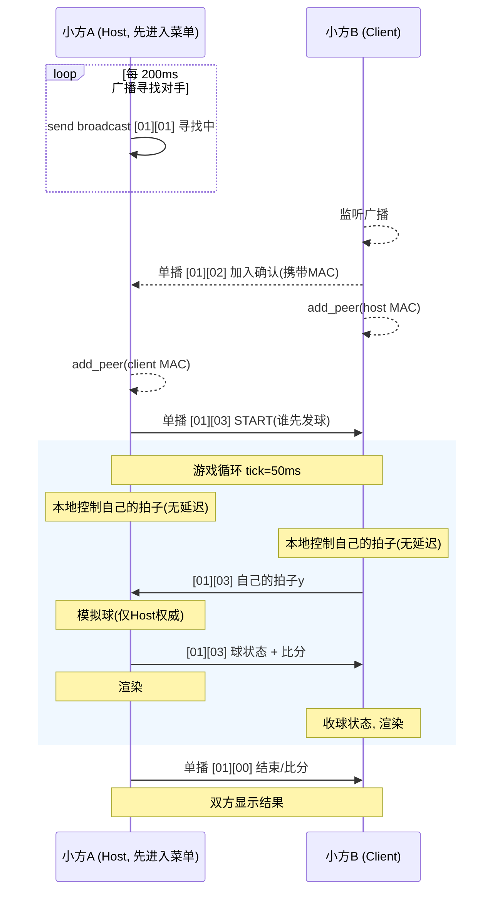

- 功能名称: 对打球
- 开始时间: 2024-10-14
- 更新时间: 2026-09-12

# 摘要

用Rust设计一款"对打球"的功能，运行在 esp32c3 上，显示在`8*8`的 ws2812 点阵上。两台小方通过 ESP-NOW 联机对战。

# 目的

Rust、esp32c3、ws2812 的学习使用；

# 解释

## ESP-NOW简介

ESP-NOW 是一种由乐鑫公司定义的无连接 Wi-Fi 通信协议。在 ESP-NOW中，应用程序数据被封装在各个供应商的动作帧中，然后在无连接的情况下，从一个 Wi-Fi 设备传输到另一个 Wi-Fi 设备。

CTR 与 CBC-MAC 协议 (CCMP) 可用来保护动作帧的安全。ESP-NOW 广泛应用于智能照明、远程控制、传感器等领域。

# 详细设计

## 交互过程

1. 由其中一方如A发起广播数据，B接收广播数据后，B向A发送单播确认信息，A收到确认信息后开始通讯。

其中A发送的广播数据格式如下：

```
01  00             101010101010101
^   ^              ^
|   |              |
|   |              |
|   |              |
|   |              |
表  00表示结束     游戏中产生的数据
示  01表示游戏中
哪
款
游
戏
```

2. 谁先响应A，A就和谁通信，停止广播，发送数据
3. 开始数据交互
4. 游戏结束，计算结果，显示结果，停止发送数据

其中：

| 代码 | 说明   |
| ---- | ------ |
| 00   | 无     |
| 01   | 对打球 |

# 实现方案（ESP-NOW）

- 硬件: ESP32-C3 × 2（8x8 WS2812 屏、MPU6050 倾斜控制、蜂鸣器）
- 通信: ESP-NOW（esp-radio 0.18.0，feature `esp-now` 已启用）

## 总体架构



**同步模型（关键决策）**：
- **球：Host 权威模拟**。Client 不模拟球，只渲染 Host 每 tick 发来的球状态 → 杜绝丢包导致的物理发散。
- **拍子：双方本地控制**。自己的拍子由自己的加速度计直接驱动，响应零延迟；对方拍子位置经 ESP-NOW 传输，滞后一个 tick（~50ms），可接受。
- **比分**：Host 裁决，随球状态包下发。

## 协议帧格式

每帧 ≤ 8 字节，`byte[0] = 游戏码 0x01`（对打球），`byte[1] = 状态`。

| byte0 | byte1 | byte2 | byte3 | byte4 | 说明 |
|-------|-------|-------|-------|-------|------|
| 0x01 | 0x01 寻找中 | 0x00 | - | - | Host 每 200ms 广播，直到收到确认 |
| 0x01 | 0x02 加入确认 | 0x00 | - | - | Client 单播回复（对方 MAC 取自 `ReceiveInfo.src_address`） |
| 0x01 | 0x03 START | 发球方(0/1) | - | - | Host 单播，双方对齐初始状态 |
| 0x01 | 0x03 游戏中 | 拍子y(0-7) | 球x(0-7) | 球y(0-7) | Client → Host：仅发自己拍子y（byte2，其余 0） |
| 0x01 | 0x03 游戏中 | 拍子y(0-7) | 球x | 球y | Host → Client：拍子y + 球x,y + byte5/6/7 速度与比分 |
| 0x01 | 0x00 结束 | 比分 | - | - | Host 单播，双方显示结果 |

Host 游戏数据包（7 字节）：
```
[0]=0x01 [1]=0x03 [2]=host拍子y [3]=球x [4]=球y [5]=vx低4位|vy低4位(bit0-2=球速档) [6]=Host分|Client分
```

## 文件级改动

### main.rs（改）
- `let (mut _wifi_controller, interfaces) = esp_radio::wifi::new(...)`（不再丢弃 interfaces）
- 取出 `interfaces.esp_now` 与 `interfaces.station.mac_address()`，其余字段丢弃
- `esp_now.set_channel(6)`（双方固定同一信道；若将来做多组对战可差异化）
- 传入 `App::new(..., esp_now, my_mac)`

### lib.rs（改）
- `App` 增加字段：`esp_now: Option<EspNow<'d>>`、`my_mac: [u8; 6]`
- `App::new` 增加两个参数
- `run()` 的 match 中加：`Ui::PlayBall => PlayBall::new().run(&mut self).await`

### ui.rs（改）
- `Ui` 枚举加 `PlayBall` 变体；`uis()` 数组扩为 11 项；`ui()` 加 8x8 图标（双拍+球）

### play_ball.rs（新增，核心）
```rust
pub struct PlayBall {
    role: Role,              // Host / Client
    peer: [u8; 6],           // 对方 MAC
    my_paddle: u8,           // 我的拍子 y (0-7)
    peer_paddle: u8,         // 对方拍子 y
    ball: (i32, i32),        // 球位置（float 用 i32 定点，×8）
    vel: (i32, i32),         // 球速度
    score: (u8, u8),         // (我, 对方)
    last_rx: Instant,        // 断线检测
    game_over: bool,
}
```
- `pub async fn run(&mut self, app: &mut App<'_>)`：
  1. **握手阶段**（超时 5s，无对手则蜂鸣提示并 return 回菜单）
     - Host：循环 `send(BROADCAST, [01][01])` + `Timer 200ms` + `receive()` 轮询，收到 `[01][02]` 即 `add_peer(对方MAC)`，break
     - Client：循环 `receive_async()`（用 `embassy_futures::select` 与超时 Timer 竞争），收到 `[01][01]` 即 `add_peer`、`send(对方MAC, [01][02])`，break
     - 握手完成：Host 发 `[01][03] START`，双方进入游戏循环
  2. **游戏循环**（`Timer::after_millis(50)`）：
     - `app.acc_direction()` → 我的拍子 y±1（Front=上 Back=下，边界 0-7）
     - Host：消费 rx 队列里的对方拍子 y；模拟球（定点 i32，球速初始 (2,1)×8，撞墙/撞拍反弹，出界判定）；`send(peer, 球状态包)`
     - Client：`send(peer, [01][03][my_paddle][0][0])`；消费 rx 队列更新球与比分
     - 渲染（双方相同布局，见下）；断线：`last_rx > 500ms` → 显示掉线，蜂鸣，return
  3. **结束**：Host 比分到 5 或收 0x00 → 显示比分（`ledc.draw_score`）+ 胜负动画 + 蜂鸣，return

- 收包统一用 `app.esp_now.as_mut().unwrap().receive()` 非阻塞轮询 + 每 tick 一次性取空队列（简单可靠）；发送用 `send_async(...).await`（避免 `SendWaiter` drop 自旋阻塞 executor）。

### buzzer.rs（改）
按既有模式加 4 个音效：`pong_connect`（配对成功）、`pong_hit`（击球）、`pong_score`（得分）、`pong_over`（比赛结束）。

### 断线/退出
- 比赛结束或掉线 → `buzzer` 提示 → `break` 返回 `App::run` 主菜单循环。
- 返菜单前不 `deinit` ESP-NOW（保持初始化，`EspNow` 生命周期同 App）。

## 8x8 渲染布局

```
P=拍子(2格白) B=球(红) .=
H:  HHHHHHHH
    .B......
    ....P...
    ....P...
```
- 列 0 我方拍子、列 7 对方拍子，各占 y-1..y 两格，白色
- 球为 1 格，红色；得分方全屏闪色一帧（复用 `eat_flash` 模式）
- 比分显示：`ledc.draw_score`（复用现有）

## 坑与对策

| 坑 | 对策 |
|----|------|
| `send()` 的 `SendWaiter` drop 自旋等中断回调 | 一律用 `send_async().await` |
| ESP-NOW 与 BLE 共存（COEX）+ 内存 | 项目已预留双 heap（66320+64KB）；若编译/运行内存不足，`ControllerConfig` 调小 `rx_queue_size`/`static_rx_buf_num`，或进入游戏时暂不建 BLE 连接 |
| 双机信道不一致 | 双方都 `set_channel(6)`；握手失败归因到信道 |
| Client 渲染滞后/丢包 | 球状态每 tick 覆盖式更新，跳帧不累积；断线按 500ms 超时兜底 |
| `receive_async` 与超时并发 | 用 `select`（embassy-futures 已在依赖）包住收包与 `Timer`，超时即回菜单 |
| `wifi_ap.rs` 空壳 | 不涉及，联机走 ESP-NOW 不走 AP |
| Host 中途退出 | Client 端 500ms 无包 → 判掉线回菜单 |

## 验证方式

1. **编译**：`cargo build`（riscv32imc-unknown-none-elf）确认通过、内存不超。
2. **单机自测（无第二台）**：进入 `PlayBall` 菜单应显示"寻找中"动画，5s 后超时蜂鸣回菜单——验证握手超时路径与渲染。
3. **双机验证**：
   - 同时进入菜单 → 一台显示配对成功进入游戏，另一台同步
   - 倾斜控制拍子；击球/得分/比分到 5 结束、两端显示一致
   - 中途关机一台 → 另一端 500ms 内显示掉线回菜单
4. **日志**：`espflash monitor`，在握手/收发关键点加 `defmt::info!`（本机 MAC、对方 MAC、每 10 tick 打一次球位置）。

# 未解决的问题

xxxxxxxxxxxxxxxxxxxx

# 缺点

为什么不能这样做？

# 替代品

未调查

# 未来展望

无

# 参考链接

- https://docs.espressif.com/projects/esp-idf/zh_CN/latest/esp32c3/api-reference/network/esp_now.html
